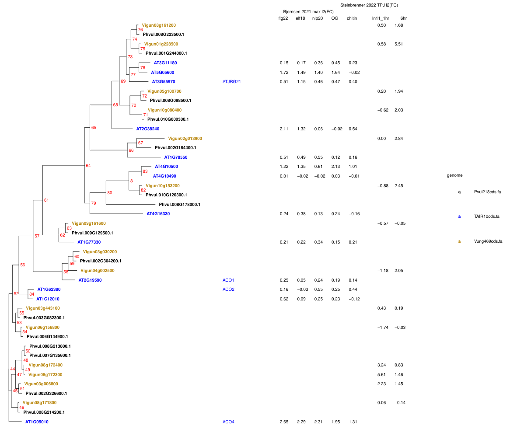

# blast-align-tree
A pipeline to identify homologs and perform phylogenetic analysis with local BLAST databases
 
## Introduction
One common comparative genomic analysis is to find similar genes and compare them using phylogenetics methods. As an alternative to using online tools for such analyses, researchers may wish to download genomes of interest for local BLAST and downstream analyses. Homolog curation, tree construction, header parsing, and visualization alongside other quantitative data (e.g. expression data) can give quick insights into a gene family of interest.


## Installation
The following should be in your path

clustalo (ClustalOmega)

FastTree http://www.microbesonline.org/fasttree/

prank http://wasabiapp.org/software/prank/

trimAl http://trimal.cgenomics.org/trimal

Clone the repository which includes two genomes, Arabidopsis (TAIR10) and common bean 2.1

An example output can be found in subfolder AT4G33430.1, including a tree PDF in the subfolder "output":
https://github.com/steinbrennerlab/blast-align-tree/blob/main/AT4G33430.1/output/SERK_tree.pdf


## Run blast-align-tree for ACC Oxidase
Try the pipeline yourself by pulling 15 homologs of Arabidopsis ACC Oxidase 1. Specify the query using the locus ID AT2G19590.1
```
bash blast-align-tree.sh AT2G19590.1 TAIR10cds.fa -n 15 15 15 -dbs TAIR10cds.fa Pvul218cds.fa Vung469cds.fa -hdr gene: polypeptide= locus= 
```
This should populate a subfolder with blast outputs, alignments, and tree visualizations



## Redraw the ACC Oxidase tree
You can iterate on the tree by calling visualize-tree.R separately. Use option "-h" to see all visualization options. 

For example, the default tree shows ACOs as outgroups. You can reroot using option -a. 

Reroot on the outgroup oxigenase JRG21 (AT2G38240). Option -b outputs to a new filename, "ACO_v2"
```
Rscript visualize-tree.R -e AT2G19590.1 -b ACO_v2 -a AT2G38240
```

Now draw a third tree showing just the ACO clade. Specify the node number (-n 58) and the script will use tree_subset to draw a subtree. Other options will show bootstraps (-k 1), omit node number labels (-l 0), and enlarge the gene symbol text (-m 2)
```
Rscript visualize-tree.R -e AT2G19590.1 -b ACO_v3 -a AT2G38240 -n 58 -k 1 -l 0 -m 2 
```


## Adding genomes
Add coding sequences files in fasta format to the genomes subdirectory, then compile a local BLAST database using 

```makeblastdb -in GenomeCDS.fa -parse_seqids -dbtype nucl```

Take note of appropriate header to specify when calling the bash script

