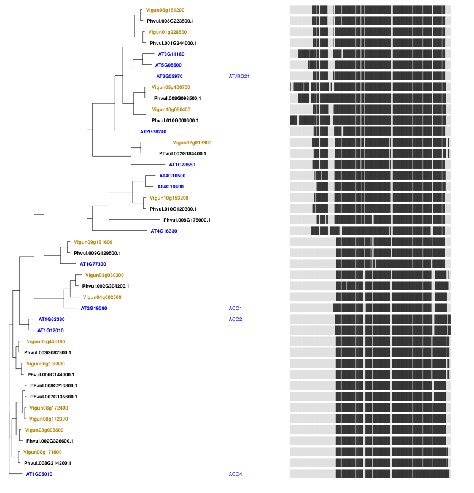

# blast-align-tree
A pipeline to identify homologs and perform phylogenetic analysis with local BLAST databases
 
## Introduction
One common comparative analysis is to find similar genes across a set of genomes and compare them using phylogenetic methods. As an alternative to using online tools for such analyses, researchers may wish to download genomes of interest for local BLAST and downstream analyses. Homolog curation, tree construction, header parsing, and visualization alongside other datasets (e.g. gene expression) can give quick insights into a gene family of interest.


## Installation
The following should be in your path

clustalo (ClustalOmega)

FastTree http://www.microbesonline.org/fasttree/

prank http://wasabiapp.org/software/prank/

trimAl http://trimal.cgenomics.org/trimal

Clone the repository which includes three genomes, Arabidopsis (TAIR10), cowpea (Phytozome), and common bean (Phytozome)

## Example output
An example output can be found in the subfolder AT4G33430.1, including a tree PDF in the subfolder "output":
https://github.com/steinbrennerlab/blast-align-tree/blob/main/AT4G33430.1/output/SERK_tree.pdf

It is the result of running the following bash and R scripts to generate fasta, newick files, and creating a subtree PDF
```
bash tblastn-align-tree.sh -q AT4G33430.1 -qdbs TAIR10cds.fa -n 15 15 15 -dbs TAIR10cds.fa Pvul218cds.fa Vung469cds.fa -hdr gene: polypeptide= locus=
Rscript visualize-tree.R -e AT4G33430.1 -b SERK_tree -a AT5G10290 -n 45
```


## Run blast-align-tree for ACC Oxidase
The code below calls the blast-align-tree.sh bash script to find 15 homologs of Arabidopsis ACC Oxidase 1 from the Arabidopsis, bean, and cowpea genomes. Specify the query sequence using the locus ID AT2G19590.1 from TAIR10cds.fa. Specify the databases to query using the option "-dbs". The -hdr option will parse fasta descriptions for a specific regular expression -- for example it will look for "polypeptide=" in the common bean fasta descriptions (Pvul218cds.fa)
```
bash tblastn-align-tree.sh -q AT2G19590.1 -qdbs TAIR10cds.fa -n 15 15 15 -dbs TAIR10cds.fa Pvul218cds.fa Vung469cds.fa -hdr gene: polypeptide= locus= 
```
This script will create a folder "AT2G19590.1" and populate a subfolder "output" with blast outputs, alignments, and tree visualizations in pdf format. 

A powerful feature of ggtree is the ability to plot associated data. The default PDF will include log2(fold-change) data from two RNAseq datasets from Bjornsen et al. 2021 (Arabidopsis) and Steinbrenner et al. 2021 (cowpea). 


An alternative PDF with ".msa" appended will show a cartoon alignment. This is useful to show large differences in domain architecture between hits. You can explore the alignments in more detail by opening the .fasta files in the "output" folder



## Redraw the ACC Oxidase tree
You can generate new versions of the pdf tree by running visualize-tree.R separately. Use option "-h" to see all visualization options. 

For example, the default tree shows ACOs as outgroups. You can reroot using option -a. 

The code below will generate a new tree rerooted on the outgroup oxigenase JRG21 (AT2G38240). Option -b specifies a new filename "ACO_v2"
```
Rscript visualize-tree.R -e AT2G19590.1 -b ACO_v2 -a AT2G38240
```

The code below will create a third tree showing just the ACO clade by using option -n to specify the node number (-n 58). The script will use the function tree_subset to draw a subtree. The three other options specify to show bootstraps (-k 1), to omit node number labels (-l 0), and to enlarge the gene symbol text (-m 2)
```
Rscript visualize-tree.R -e AT2G19590.1 -b ACO_v3 -a AT2G38240 -n 58 -k 1 -l 0 -m 2 
```


## Use BLASTP instead of TBLASTN
You can run the pipeline against protein databases with a modified version of the script. The code below will pull 10 BIK1 homologs from Arabidopsis thaliana and Nicotiana benthamiana proteomes
```
bash blastp-align-tree.sh -q AT2G39660.1 -qdbs TAIR10cds.fa -n 11 11 -dbs TAIR10protein.fa Niben261_genome.annotation.proteins.fasta -hdr gene: id
```

## Multiple queries
You can add multiple query sequences (-q) to blast each database (-dbs). The bash script will extract the query sequences from the databases specified in -qdbs by translating the sequences. The main bash script will remove duplicate sequences before alignment with an AWK command.

As an example, the code below will extract BLAST hits for two queries: AT5G45250.1 (from TAIR10cds.fa) and Phvul.007G077500.1 (from Pvul218cds.fa). 
```
bash tblastn-align-tree.sh -q AT5G45250.1 Phvul.007G077500.1 AT5G17890.1 -qdbs TAIR10cds.fa Pvul218cds.fa TAIR10cds.fa -n 3 4 -dbs TAIR10cds.fa Vung469cds.fa -hdr gene: locus=
```


## Adding genomes
You can add additional genomes to the genomes subdirectory. Because the scripts extract translated nucleotide sequences, the genomes must be coding sequences in fasta format rather than other assembly/annotations. You must add compile a local BLAST database for each added genome

```makeblastdb -in GenomeCDS.fa -parse_seqids -dbtype nucl```

You can now search "GenomeCDS.fa" if you list it under the -dbs option. Scan your genome file to find an appropriate header (using option -hdr) when calling the bash script

